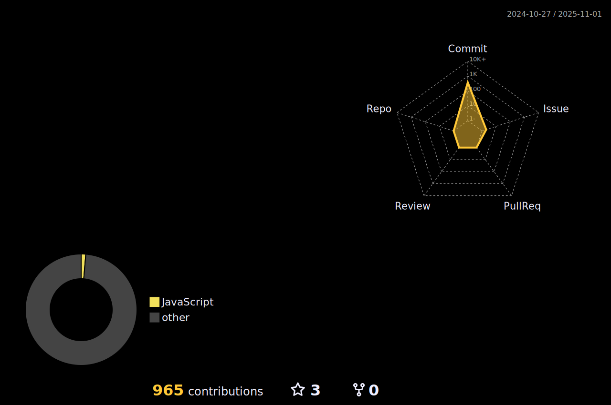

 
  
  
  
  

### Career Summary

Worked for a major apparel brand for 5 years. Through self-study and reading of programming, he learned about problem solving through technology and decided to become an engineer, and enrolled in the programming school RUNTEQ in April 2021. He then developed and released "Mikke Custom Journaling" on his own. It achieved more than 1500 PV / 200 UUs per month. Currently, he is creating an app using React/TypeScript. As for personal activities, I am managing an online community "DIALogue".

- [Izumi Haruya website](https://kousei089.github.io/portfolio-izuha/) - This is a website about Haruya Izumi's career to date, portfolio and daily output.

---

### Outputs

- [Zenn](https://zenn.dev/kousei_089) - At Zenn, we focus on programming outings, We mainly use scraps of books as output.

- [note](https://note.com/izuha0) - I write in "note" to share the flow of my thoughts, I hope you will think, "Oh, I know what you mean.

- [Twitter](https://twitter.com/izuha0) - On Twitter, I output about my daily studies, hobbies, and areas of interest. I also host a study group once a week, so please feel free to DM me if you are interested.

- [DIALogue](https://zenn.dev/kousei_089/scraps/d3afca9650230a) - In the online community "DIALouge", we are trying to think about a single question, moving back and forth between the concrete and the abstract. We also offer programming and engineering related studies. We meet every Sunday for 4~5 hours.
